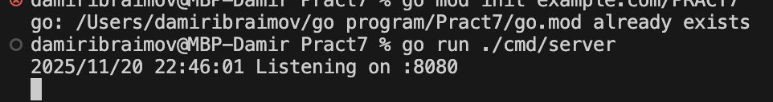

# Практическое занятие 7 Ибраимов Дамир ПИМО-01-25: Работа с Redis

## Описание проекта

Данный проект представляет собой реализацию HTTP-сервиса на языке Go, который взаимодействует с NoSQL хранилищем **Redis**. В приложении реализован REST API для выполнения базовых операций: сохранения данных с указанием времени жизни (TTL), получения значений по ключу и проверки оставшегося времени жизни записи.


## Краткое описание

### Redis

**Redis** — это высокопроизводительная in-memory система хранения данных, работающая по принципу ключ-значение. Основные особенности:
* Отсутствие жесткой схемы данных (NoSQL).
* Поддержка сложных структур данных (списки, хэши, множества).
* Встроенные механизмы очистки устаревших данных.
* Используется как кэш, брокер сообщений или сессионное хранилище.

### Механизм TTL

**TTL (Time-To-Live)** — механизм, позволяющий задать срок жизни для конкретного ключа. По истечении указанного времени Redis автоматически удаляет запись, освобождая оперативную память. Это критически важно для хранения временных данных, таких как сессии авторизации или кэшированные ответы API.

## Запуск проекта


# Запуск Redis


# Запуск сервера
```
go run ./cmd/server
```


# Тестирование
```
curl "http://localhost:8080/set?key=test&value=hello"
```

```
curl "http://localhost:8080/get?key=test"
```

```
curl "http://localhost:8080/ttl?key=test"
```


## Контрольные вопросы

1. **Чем Redis отличается от реляционной БД?**
    * Место хранения: Redis хранит данные в оперативной памяти (RAM), что намного быстрее, чем хранение на диске в реляционных БД.

    * Структура: Redis — это NoSQL (key-value) хранилище без жесткой схемы таблиц и связей, в то время как реляционные БД используют таблицы, строки и внешние ключи.

    * Язык запросов: Redis использует специальные команды (SET, GET, HGET), а не SQL.

2. **Какие типы данных поддерживает Redis кроме строк?**
   * Lists (Списки): коллекции строк, упорядоченные по вставке.
   * Sets (Множества): неупорядоченные коллекции уникальных строк.
   * Hashes (Хэши): карты полей и значений (идеально для объектов).
   * Sorted Sets (Упорядоченные множества): множества, где каждый элемент связан с числовым скором.

3. **Зачем нужен TTL? Приведите примеры.**
   * TTL необходим для автоматического удаления данных, которые актуальны только ограниченное время. Это предотвращает засорение памяти.

   * Например - Хранение SMS-кода подтверждения (живет 60 секунд).
               Кэширование курса валют (обновляется раз в час).

4. **Как Redis помогает снизить нагрузку на PostgreSQL?**
   * Используется паттерн Cache-Aside. Приложение сначала ищет данные в быстром Redis. Если данные найдены («cache hit»), запрос к "тяжелой" PostgreSQL не выполняется. Это снимает нагрузку с дисковой подсистемы основной базы данных при частых однотипных запросах на чтение.

5. **Что произойдёт, если ключ в Redis «протух» по TTL, а приложение попытается его прочитать?**
   * Redis вернет специальный ответ, означающий отсутствие данных (в библиотеке go-redis это ошибка redis.Nil). Приложение должно обработать эту ситуацию как Cache Miss: сходить в основную базу данных за свежими данными, вернуть их пользователю и снова сохранить в Redis.


