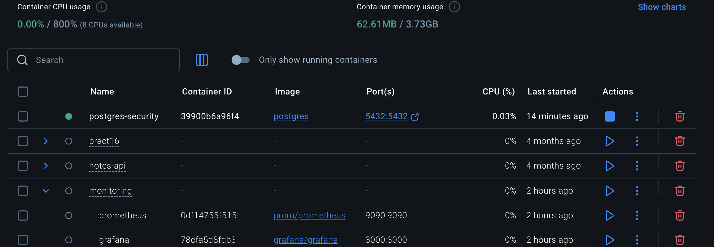
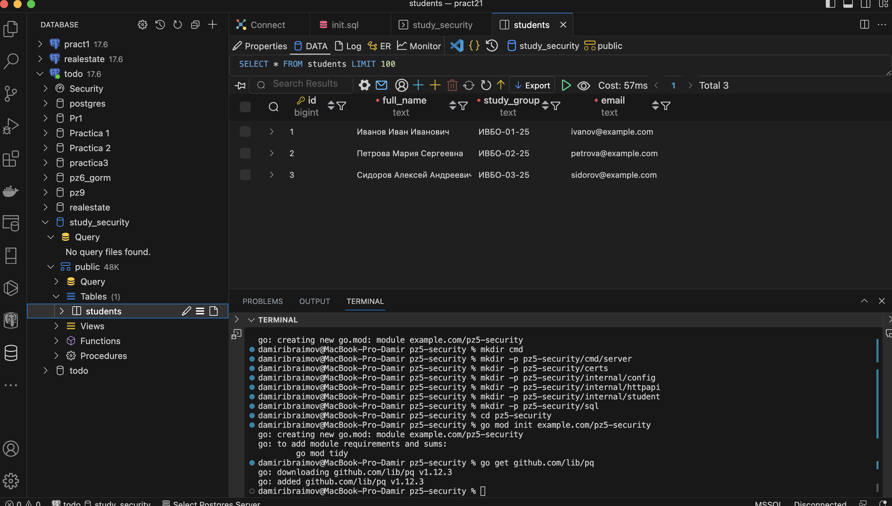

## Реализация HTTPS (TLS-сертификаты). Защита от SQL-инъекций.


## Структура проекта

- `cmd/server/` — точка входа в приложение (запуск HTTPS-сервера).
- `certs/` — директория для хранения локальных TLS-сертификата и приватного ключа.
- `internal/config/` — конфигурация приложения (DSN, порты, пути).
- `internal/httpapi/` — HTTP-обработчики маршрутов.
- `internal/student/` — бизнес-модели и слой взаимодействия с базой данных (Repository).
- `sql/` — SQL-скрипты для инициализации структуры и тестовых данных.

## Требования

Для запуска проекта локально потребуется:
- Установленный **Go** (версия 1.18+).
- Установленный **PostgreSQL**.
- Утилита **OpenSSL** (для генерации TLS-сертификатов).

### 1. Подготовка базы данных

Запустили PostgreSQL, создли базу данных (например, `study_security`) + инициализация таблиц:

```bash
psql -h 127.0.0.1 -U postgres -d security
```



### 2. Генерация TLS-сертификата

```bash
openssl req -x509 -newkey rsa:2048 -nodes -keyout certs/server.key -out certs/server.crt -days 365 -subj "/CN=localhost"
```


### 2. Запуск приложения

```bash
go mod tidy
go run ./cmd/server
```

### Проверка статуса сервиса:
```bash
curl -k https://localhost:8443/health
```


### Получить информацию о студенте :

```bash
curl -k "https://localhost:8443/students?id=1"
```


```bash
curl -k "https://localhost:8443/students?id=999"
```


### Ответы на контрольные вопросы

#### Чем HTTP отличается от HTTPS?

HTTP передаёт данные в открытом виде без какого-либо шифрования, поэтому они могут быть перехвачены. HTTPS использует TLS, который шифрует соединение между клиентом и сервером и защищает данные от чтения и изменения при передаче.

#### Какую роль выполняет TLS в защищённом соединении?

TLS обеспечивает защищённый канал связи, шифруя передаваемые данные, проверяя подлинность сервера через сертификаты и гарантируя целостность информации, чтобы она не была изменена в пути.

#### Что такое TLS-сертификат?

TLS-сертификат представляет собой цифровой файл, который содержит публичный ключ и информацию о сервере, подтверждая его идентичность и позволяя клиенту убедиться, что он подключается к настоящему серверу.

#### Что делает tls.LoadX509KeyPair?

Функция tls.LoadX509KeyPair загружает сертификат и приватный ключ из PEM-файлов, разбирает их и возвращает структуру tls.Certificate, которая затем используется для настройки HTTPS-сервера в Go.

#### Почему self-signed certificate подходит для локальной учебной среды, но не для публичного production-сервиса?

Самоподписанный сертификат не выдан доверенным центром сертификации, поэтому браузеры считают его небезопасным. В учебной среде этого достаточно для тестирования HTTPS, но в реальных сервисах такие сертификаты вызывают недоверие пользователей и предупреждения безопасности.

#### Что такое SQL-инъекция?

SQL-инъекция — это уязвимость, при которой злоумышленник с помощью специально сформированного ввода может изменить структуру SQL-запроса и выполнить нежелательные операции в базе данных.

Почему конкатенация строки SQL с пользовательским вводом опасна?

Потому что пользовательский ввод может быть интерпретирован как часть SQL-команды, что позволяет изменить логику запроса, например заставить условие всегда возвращать true и получить доступ к данным.

#### Что такое parameterized query?

Это способ выполнения SQL-запросов, при котором структура запроса и значения параметров передаются отдельно, благодаря чему база данных обрабатывает ввод только как данные, а не как часть SQL-кода.

#### Что такое prepared statement?

Prepared statement — это заранее подготовленный и сохранённый на стороне базы SQL-запрос, который можно многократно выполнять с разными параметрами, повышая безопасность и эффективность выполнения.

#### Почему placeholder syntax может отличаться в разных СУБД и драйверах?

Разные СУБД используют собственные синтаксические правила для обозначения параметров в запросах: PostgreSQL применяет $1, $2, MySQL использует ?, а другие системы могут использовать именованные параметры, что зависит от их внутреннего диалекта SQL и драйвера подключения.