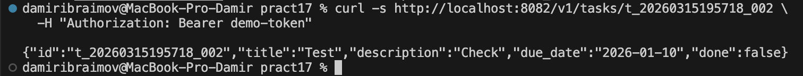

# Microservices: Auth + Tasks

## Описание проекта

Проект реализует два независимых микросервиса:

- Auth Service (порт 8081) — отвечает за аутентификацию и проверку токена.
- Tasks Service (порт 8082) — выполняет CRUD‑операции над задачами и требует валидный токен.

Сервисы общаются между собой через HTTP: Tasks вызывает Auth для проверки токена.

---

## Структура проекта

tech-ip-sem2/
  go.mod
  go.sum

  services/
    auth/
      cmd/
        auth/
          main.go
      internal/
        http/
          handlers.go
          router.go
        service/
          auth.go

    tasks/
      cmd/
        tasks/
          main.go
      internal/
        http/
          handlers.go
          router.go
        service/
          tasks.go
      client/
        authclient/
          client.go

  shared/
    middleware/
      logging.go
      requestid.go
    httpx/
      client.go


## Установка зависимостей

```bash
cd tech-ip-sem2
go get github.com/google/uuid
go clean -cache
go clean -modcache
go mod tidy
```


## Запуск сервисов

Открыть два терминала.

### 1. Auth Service (порт 8081)

```bash
cd tech-ip-sem2/services/auth
go run ./cmd/auth
```


### 2. Tasks Service (порт 8082)
```bash
cd tech-ip-sem2/services/tasks
export AUTH_BASE_URL=http://localhost:8081
go run ./cmd/tasks
```


## Проверка API

# 1. Авторизация (Auth Service)

## 1.1 Login

```bash
curl -s -X POST http://localhost:8081/v1/auth/login \
-H "Content-Type: application/json" \
-d '{"username":"student","password":"student"}'
```


## 1.2 Verify

```bash
curl -s http://localhost:8081/v1/auth/verify \
-H "Authorization: Bearer demo-token"
```


# 2. Работа с задачами (Tasks Service)

## 2.1 Создать задачу

```bash
curl -s -X POST http://localhost:8082/v1/tasks \
-H "Content-Type: application/json" \
-H "Authorization: Bearer demo-token" \
-d '{"title":"Test","description":"Check","due_date":"2026-01-10"}'
```


## 2.2 Получить список задач

```bash
curl -s http://localhost:8082/v1/tasks \
-H "Authorization: Bearer demo-token"
```


## 2.3 Получить задачу по ID

```bash
curl -s http://localhost:8082/v1/tasks/<ID> \
-H "Authorization: Bearer demo-token"
```



## 2.4 Обновить задачу

```bash
curl -s -X PATCH http://localhost:8082/v1/tasks/<ID> \
-H "Content-Type: application/json" \
-H "Authorization: Bearer demo-token" \
-d '{"title":"Updated"}'
```


## 2.5 Удалить задачу

```bash
curl -s -X DELETE http://localhost:8082/v1/tasks/<ID> \
-H "Authorization: Bearer demo-token"
```


## Ответы на контрольные вопросы
- Почему межсервисный вызов должен иметь таймаут?
Без таймаутов, если сервис Auth недоступен или работает медленно, сервис Tasks будет бесконечно ждать ответа, исчерпает ресурсы (например, пул соединений) и тоже "повиснет" (возникнет каскадный сбой).

- Чем request-id помогает при диагностике ошибок?
Поскольку один клиентский запрос может проходить через несколько микросервисов, request-id позволяет найти и связать все логи, относящиеся к этому конкретному запросу в разных сервисах.

- Какие статусы нужно вернуть клиенту при невалидном токене?
Необходимо вернуть HTTP статус 401 Unauthorized (или 403 Forbidden в случае недостатка прав).

- Чем опасно “делить одну БД” между сервисами?
Это создает сильную связность на уровне данных. Сервисы теряют независимость: изменение схемы БД одним сервисом может сломать работу другого.