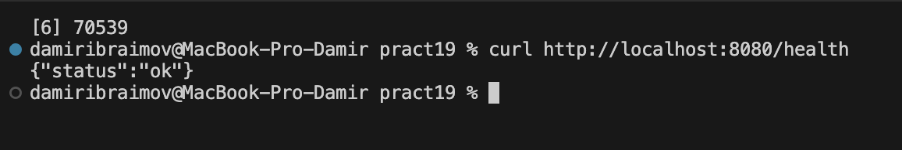
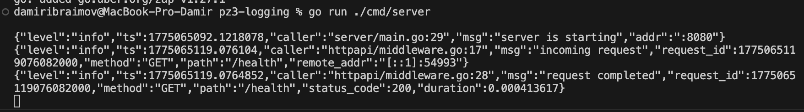
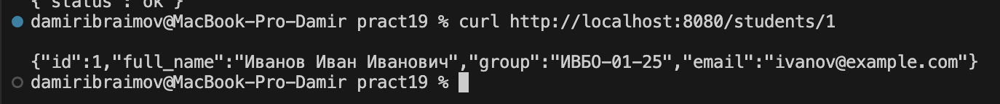
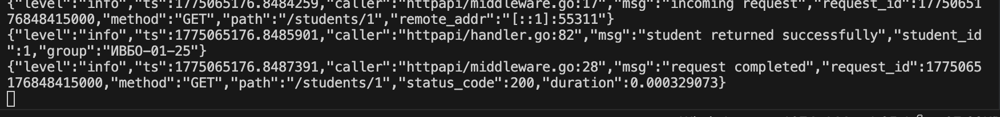
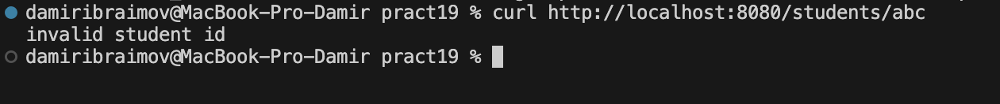
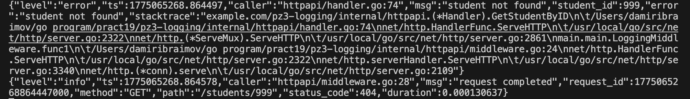

# Практическое занятие №3 — Логирование с помощью zap

## Структура проекта

```text
pz3-logging/
│
├── cmd/
│   └── server/
│       └── main.go
│
├── internal/
│   ├── httpapi/
│   │   ├── handler.go
│   │   ├── middleware.go
│   │   └── response_writer.go
│   │
│   └── student/
│       ├── model.go
│       └── repo.go
│
├── pkg/
│   └── logger/
│       └── logger.go
│
├── go.mod
└── README.md
```

## Создание папок проекта в VS Code (PowerShell)

```bash
mkdir pz3-logging
cd pz3-logging
mkdir cmd, internal, pkg
mkdir cmd/server, internal/httpapi, internal/student, pkg/logger
```

## Инициализация Go-модуля

```bash
go mod init example.com/pz3-logging
```

## Установка библиотеки zap

```bash
go get go.uber.org/zap
```

## Запуск проекта

```bash
go run ./cmd/server
```

## Проверка работы

### Проверка health endpoint

```bash
curl http://localhost:8080/health
```


Ожидаемый ответ:

```json
{"status":"ok"}
```


### Проверка получения студента

```powershell
curl http://localhost:8080/students/1
```


Ожидаемый ответ:

```json
{
  "id":1,
  "full_name":"Иванов Иван Иванович",
  "group":"ИВБО-01-25",
  "email":"ivanov@example.com"
}
```


### Проверка ошибки формата id

```bash
curl http://localhost:8080/students/abc
```


Ожидаемый ответ:

```bash
invalid student id
```


### Проверка отсутствующего студента

```bash
curl http://localhost:8080/students/999
```


Ожидаемый ответ:

```bash
student not found
```


# Ответы на контрольные вопросы

## 1. Зачем backend-приложению нужно логирование?

Логирование необходимо для фиксации событий, происходящих внутри backend-приложения.
С помощью логов разработчик может определить:

* когда был запущен сервер;
* какой HTTP-запрос поступил;
* какой маршрут был вызван;
* какой ответ был возвращён;
* где возникла ошибка;
* сколько времени заняла обработка запроса.

Логи используются для диагностики, сопровождения и анализа работы приложения.

---

## 2. Чем обычный текстовый лог отличается от структурированного?

Обычный текстовый лог представляет собой одну строку текста.

Пример:

```text id="9x7v3n"
user requested /students/1
```

Структурированный лог содержит отдельные поля в формате ключ-значение.

Пример:

```json id="m2k8q1"
{
  "level":"info",
  "method":"GET",
  "path":"/students/1"
}
```

Структурированные логи удобнее анализировать автоматически.

---

## 3. Что означает structured logging?

Structured logging — это способ логирования, при котором каждая запись содержит:

* сообщение;
* уровень важности;
* дополнительные поля с данными.

Пример:

```json id="p4t6c8"
{
  "msg":"student returned successfully",
  "student_id":1,
  "group":"ИВБО-01-25"
}
```

---

## 4. Какие уровни логирования используются в этой работе?

В работе используются уровни:

* Debug — подробная информация для отладки;
* Info — обычные рабочие события;
* Warn — предупреждения;
* Error — ошибки выполнения.

---

## 5. Почему полезно логировать HTTP-метод, путь и статус ответа?

Это позволяет понять:

* какой запрос поступил;
* какой endpoint был вызван;
* успешно ли завершилась обработка.

Пример:

```json id="k7r2d5"
{
  "method":"GET",
  "path":"/health",
  "status_code":200
}
```

---

## 6. Зачем в лог добавляют время выполнения запроса?

Время выполнения позволяет анализировать производительность приложения и находить медленные запросы.

Пример:

```json id="n8u3f6"
{
  "duration":"2ms"
}
```

---

## 7. Почему логирование ошибок должно содержать дополнительный контекст?

Контекст помогает быстрее определить источник ошибки.

Например:

* student_id;
* path;
* request_id.

Пример:

```json id="q5y9h2"
{
  "student_id":999,
  "error":"student not found"
}
```

---

## 8. В чём практическое преимущество zap?

Библиотека zap:

* работает быстро;
* создаёт JSON-логи;
* поддерживает уровни логирования;
* удобна для backend-приложений.

---

## 9. Что означает maintenance mode у logrus?

Maintenance mode означает, что библиотека поддерживается, но новые функции практически не добавляются.

Исправляются только ошибки и критические проблемы.

---

## 10. Почему structured logging особенно важен для микросервисов и backend API?

Потому что в микросервисах одновременно выполняется большое количество запросов.

Структурированные логи позволяют:

* быстро фильтровать события;
* искать ошибки;
* анализировать работу отдельных сервисов.


