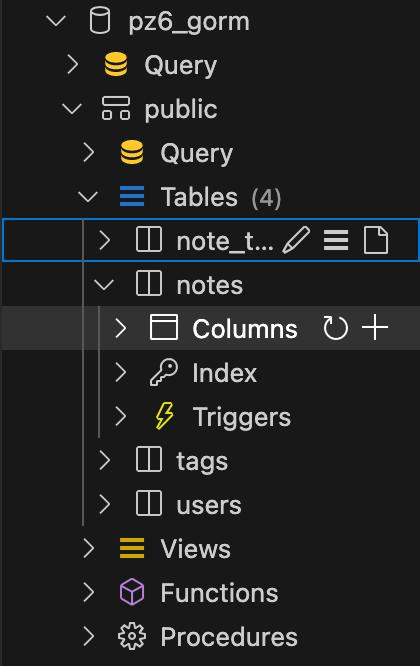
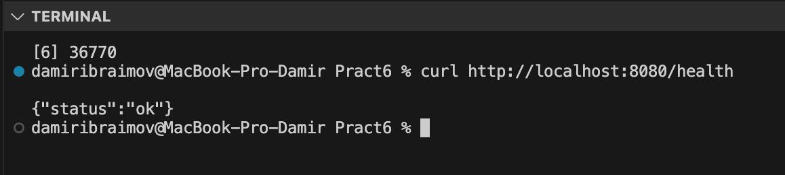
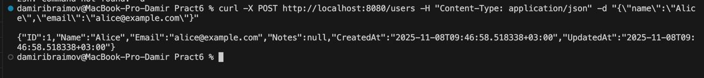
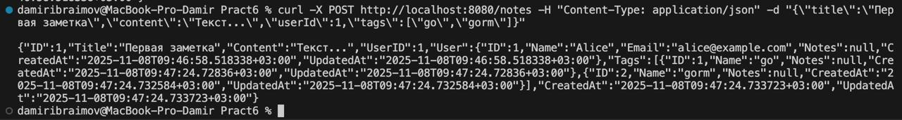
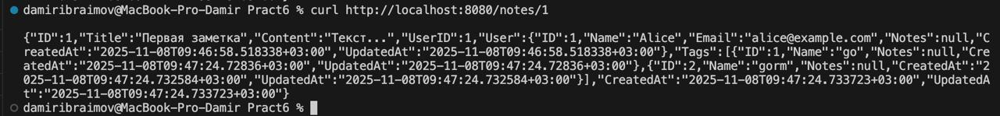
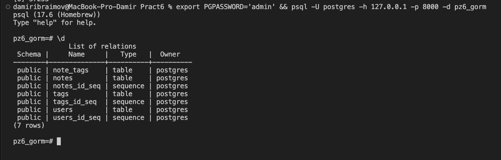

# Ибраимов Дамир ПИМО-01-25
# Практическое занятие №6: Использование ORM (GORM)

## Обзор проекта

Этот проект — минимальный REST API на Go, демонстрирующий основы работы с **GORM** (Go Object-Relational Mapper) для взаимодействия с базой данных **PostgreSQL**.

**Цели проекта:**
* Изучить концепцию ORM и возможности GORM.
* Научиться описывать модели данных (Go-структуры) и автоматически создавать таблицы (`AutoMigrate`).
* Реализовать связи **1:N** (Один ко многим) и **M:N** (Многие ко многим).
* Освоить загрузку связанных данных с помощью `Preload`.

## Настройка и Запуск

### 1. Предварительные требования

* Установленный **Go**
* Запущенный сервер **PostgreSQL**

### 2. Создание Базы Данных

Подключитесь к `psql` и создайте базу данных:
```sql
CREATE DATABASE pz6_gorm;
```



### 3. Установка зависимостей 

```bash
go mod init [example.com/pz6-gorm](https://example.com/pz6-gorm)
go get gorm.io/gorm gorm.io/driver/postgres [github.com/go-chi/chi/v5](https://github.com/go-chi/chi/v5)
```

### 4. Настройка Переменной Окружения (DB_DSN)

```bash
export DB_DSN='host=127.0.0.1 user=postgres password=admin dbname=pz6_gorm port=8000 sslmode=disable'
```

## 📁 Структура и Описание файлов
```bash
pz6-gorm/
├── cmd/
│   └── server/
│       └── main.go         
├── internal/
│   ├── db/
│   │   └── postgres.go     
│   ├── httpapi/           
│   │   ├── handlers.go    
│   │   └── router.go      
│   └── models/
│       └── models.go       
├── dump_db.sql        #Дамп Базы данных       
├── README.md              
├── go.mod                  
└── go.sum                 
```

* `cmd/server/main.go`
    * **Точка входа** в приложение. Здесь происходит подключение к БД, запуск `AutoMigrate` для создания/обновления таблиц и запуск HTTP-сервера.

* `internal/db/postgres.go`
    * Отвечает за **подключение к PostgreSQL**. Содержит функцию `Connect()`, которая читает `DB_DSN`, настраивает GORM и пул соединений [cite: 156-162].

* `internal/models/models.go`
    * **Определяет модели данных**. Содержит Go-структуры (`User`, `Note`, `Tag`), которые GORM использует для создания таблиц. Здесь описаны поля, их типы, ограничения (`not null`, `uniqueIndex`) и связи (1:N, M:N).

* `internal/httpapi/router.go`
    * **Настраивает маршрутизацию** (роутинг). Использует `chi` для определения API-маршрутов (например, `/users`, `/notes/{id}`) и связывает их с соответствующими функциями-обработчиками (хэндлерами).

* `internal/httpapi/handlers.go`
    * **Логика API**. Содержит сами функции-обработчики (хэндлеры), которые принимают HTTP-запросы, взаимодействуют с БД через GORM (`Create`, `First`, `Preload`) и отправляют JSON-ответы.

## Проверка API

### 1. Проверка здоровья 
```bash
curl http://localhost:8080/health
```


### 2. Создание пользователя (POST /users)
```bash
curl -X POST http://localhost:8080/users 
-H "Content-Type: application/json" 
-d "{\"name\":\"Alice\",\"email\":\"alice@example.com\"}"
```


### 3. Создаём заметку с тегами
```bash
curl -X POST http://localhost:8080/notes ^
  -H "Content-Type: application/json" ^
  -d "{\"title\":\"Первая заметка\",\"content\":\"Текст...\",\"userId\":1,\"tags\":[\"go\",\"gorm\"]}"
```


### 4. Получаем заметку с автором и тегами

```bash
curl http://localhost:8080/notes/1
```



### 5. Проверим данные в БД
```sql
\d
```



## Контрольные вопросы

### 1. Что такое ORM и зачем она нужна, если есть `database/sql`? Приведите 2–3 плюса и 1–2 минуса.

**ORM (Object-Relational Mapping)** — это технология, которая сопоставляет объектно-ориентированные сущности (например, структуры Go) с таблицами в реляционной базе данных. Она позволяет разработчику думать в терминах объектов и методов, а не SQL-строк, так как ORM сама формирует SQL-запросы.

**Преимущества (Плюсы) ORM:**
* **Ускорение разработки:** Меньше шаблонного SQL-кода, код становится компактнее.
* **Безопасность:** ORM автоматически использует параметризацию, защищая от SQL-инъекций.
* **Кросс-СУБД:** Один и тот же код может работать с PostgreSQL, MySQL, SQLite и т.д..

**Недостатки (Минусы) ORM:**
* **Производительность:** ORM может быть медленнее, чем вручную написанный и оптимизированный SQL.
* **Сложность:** Для сложных запросов (агрегации, оконные функции) часто все равно приходится писать сырой SQL.

### 2. Как в GORM описать связи 1:N и M:N? Какие теги на полях вы использовали?

**1:N (Один ко многим)** :
    * На стороне "один" (в `User`) добавляется поле-слайс: `Notes []Note`.
    * На стороне "многие" (в `Note`) добавляется внешний ключ `UserID uint` и опционально сама структура `User User` для вложенной загрузки.

**M:N (Многие ко многим)** :
    * В обеих моделях (`Note` и `Tag`) добавляются поля-слайсы друг друга (например, `Tags []Tag` и `Notes []Note`).
    * Обязательно используется тег **`gorm:"many2many:note_tags;"`**. `note_tags` — это имя промежуточной таблицы (join table), которую GORM создаст автоматически.

### 3. Что делает `AutoMigrate`? В каких случаях его недостаточно?

**Что делает `AutoMigrate`:**
`db.AutoMigrate(&User{}, &Note{})` анализирует структуры Go и выполняет следующие действия:
* Создает таблицы, если они еще не существуют в БД.
* Добавляет новые поля (столбцы) в таблицу, если они появились в структуре Go.

**Когда его недостаточно:**
`AutoMigrate` **не выполняет** "разрушающих" или сложных изменений схемы. Его недостаточно, если нужно:
* Удалить поля (столбцы) из таблицы.
* Изменить тип данных существующего поля.

Для таких операций требуются полноценные системы миграций или выполнение SQL-запросов вручную.

### 4. Чем `Preload` отличается от обычного `Find/First`? Когда его применять?

* **Обычный `Find/First`**: По умолчанию GORM *не загружает* связанные данные (т.н. "ленивая загрузка"). Если выполнить `db.First(&user, 1)`, поле `user.Notes` останется пустым (`nil`), даже если у пользователя есть заметки в БД.
* **`Preload`**: Это метод, который заставляет GORM принудительно подгрузить связанные данные. `db.Preload("Notes").First(&user, 1)` вернет пользователя, у которого поле `user.Notes` будет заполнено срезом его заметок.

**Когда применять:** `Preload` нужно применять тогда, когда вам нужны не только данные основной модели, но и связанные с ней данные (например, при запросе заметки `Note`, сразу же получить ее автора `User` и список тегов `Tags`).

### 5. Как в GORM обработать ошибку нарушения уникального индекса? Что вернёт БД/драйвер?

* **Что вернёт БД/драйвер:** При попытке вставить запись, нарушающую `uniqueIndex` (например, второй пользователь с тем же `email`), PostgreSQL вернет ошибку. GORM "поймает" эту ошибку.
* **Как обработать:** Ошибка будет доступна в свойстве `.Error` результата операции GORM. Мы должны проверить, что эта ошибка не равна `nil`, и вернуть клиенту соответствующий HTTP-статус.

**Пример из `handlers.go` :**
```go
u := models.User{Name: in.Name, Email: in.Email}
if err := h.db.Create(&u).Error; err != nil {
    // Ошибка! err не nil.
    // Это может быть конфликт по unique email.
    // Возвращаем HTTP 409 Conflict (или 400 Bad Request)
    writeErr(w, http.StatusConflict, err.Error()) 
    return
}
```