# Практическое занятие №4  
## Настройка Prometheus + Grafana для метрик Go-приложения

## Цель работы

Освоить базовую организацию мониторинга backend-приложения на Go с использованием Prometheus для сбора метрик и Grafana для их визуализации.

## Задачи

- Изучить назначение метрик и их роль в мониторинге приложений  
- Понять различие между логами и метриками  
- Настроить Prometheus клиент в Go  
- Реализовать endpoint `/metrics`  
- Настроить сбор метрик Prometheus  
- Подключить Prometheus к Grafana  
- Построить базовые панели мониторинга  
- Проанализировать поведение приложения по метрикам  


## Архитектура проекта
```bash
pz4-monitoring/
│
├── cmd/
│   └── server/
│       └── main.go
│           - точка входа приложения
│           - запуск HTTP сервера на :8080
│           - подключение handlers и middleware
│
├── internal/
│   ├── httpapi/
│   │   ├── handler.go
│   │   │   - обработчики HTTP запросов:
│   │   │     /health
│   │   │     /students/{id}
│   │   │
│   │   ├── middleware.go
│   │   │   - MetricsMiddleware
│   │   │   - сбор метрик (requests, errors, duration)
│   │   │
│   │   └── response_writer.go
│   │       - обёртка над http.ResponseWriter
│   │       - получение status code ответа
│   │
│   ├── metrics/
│   │   └── metrics.go
│   │       - объявление Prometheus метрик:
│   │         * app_http_requests_total
│   │         * app_http_errors_total
│   │         * app_http_request_duration_seconds
│   │
│   └── student/
│       ├── model.go
│       │   - структура Student
│       │
│       └── repo.go
│           - in-memory репозиторий студентов
│           - метод GetByID
│
├── monitoring/
│   └── prometheus.yml
│   │   - конфигурация Prometheus
│   │   - scrape jobs:
│   │      * go_app (:8080)
│   │      * prometheus (:9090)
│   └── doсker-compose.yml
```
## Запуск проекта

### 1. Установка зависимостей

```bash
go get github.com/prometheus/client_golang/prometheus
go get github.com/prometheus/client_golang/prometheus/promauto
go get github.com/prometheus/client_golang/prometheus/promhttp
```
### 2. Запуск приложения
```bash
go run ./cmd/server
```
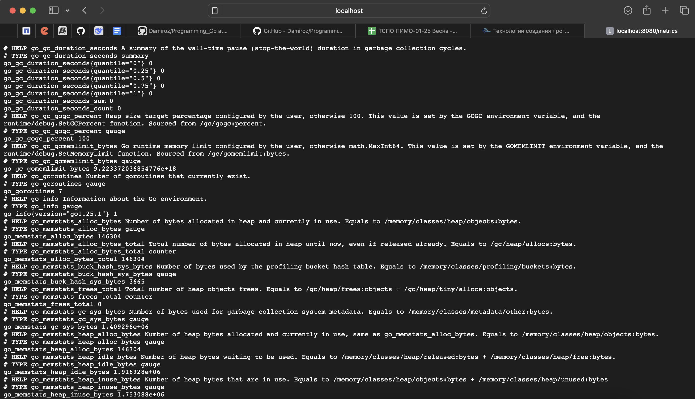

### 3. Проверка API
```bash
curl http://localhost:8080/health
```
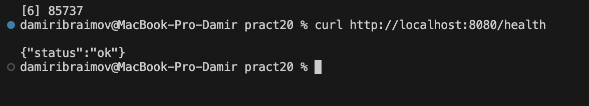

```bash
curl http://localhost:8080/students/1
```
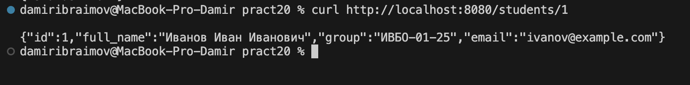

```bash
curl http://localhost:8080/students/999
```
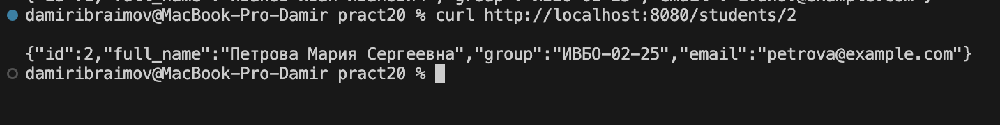

```bash
curl http://localhost:8080/metrics
```
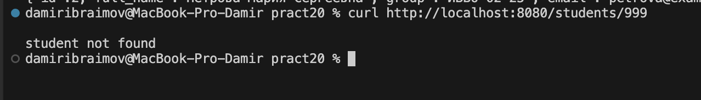

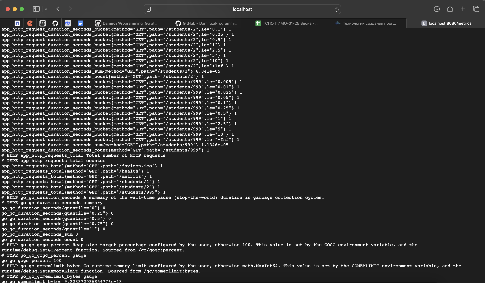

### 4. Prometheus

Запускаем его с помощью Docker.

```bash
docker compose -f "pz4-monitoring/monitoring/docker-compose.yml" up -d --build 
```
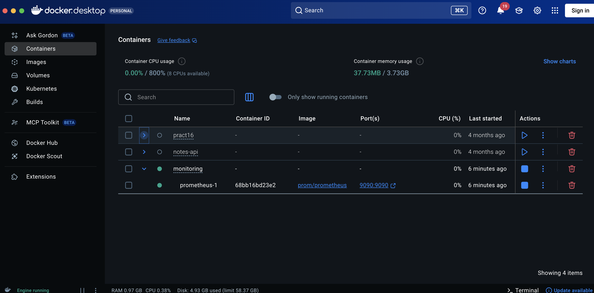

Заходим в http://localhost:9090/targets

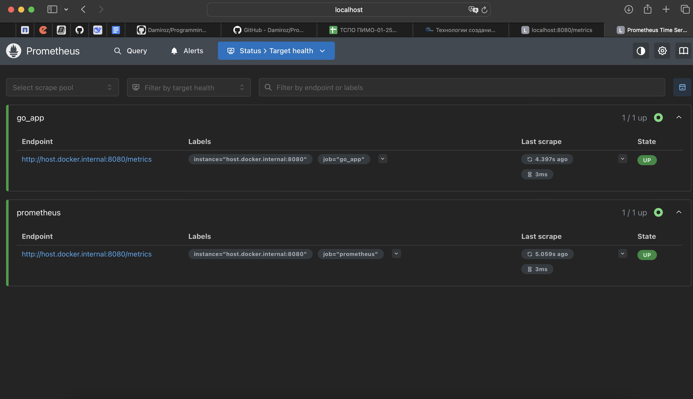

Проверим с помощью команды 

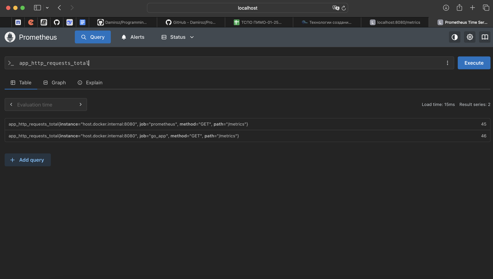

### 4. Grafana
Запускаем вместе с Prometheus с помощью Docker.

```bash
docker compose -f "pz4-monitoring/monitoring/docker-compose.yml" up -d --build 
```
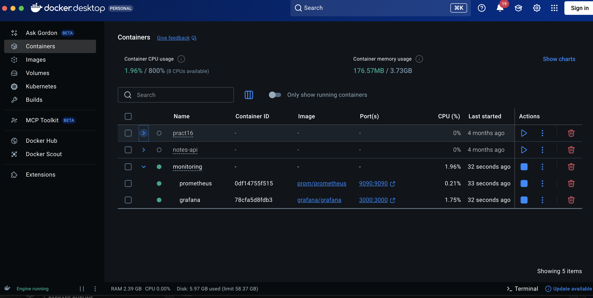
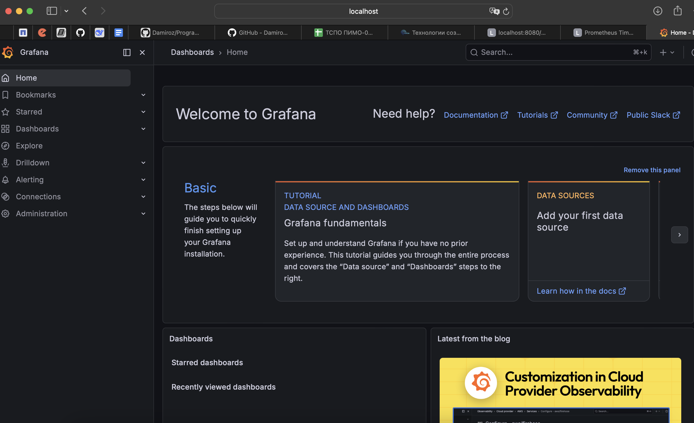

Подключаем Prometheus 
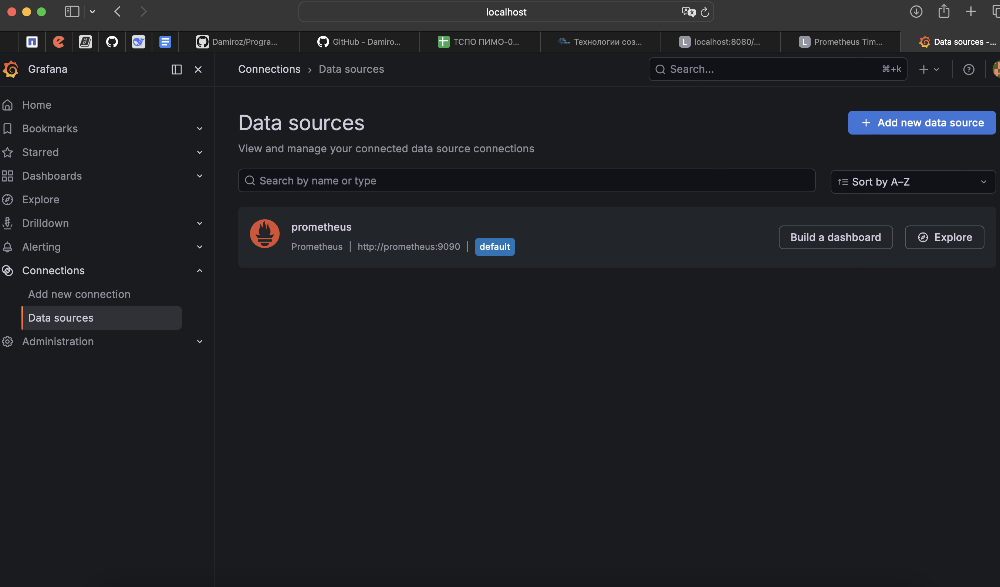

Далее создаем Dashboard для визуализации следующих запросов:
- sum(app_http_requests_total) : Общее число запросов
- sum(app_http_errors_total) : Ошибки
- sum by (path) (app_http_requests_total) : Запросы по маршрутам
- sum(rate(app_http_request_duration_seconds_sum[1m])) /
sum(rate(app_http_request_duration_seconds_count[1m])) : Средняя длительность
- sum by (status_code) (app_http_errors_total) : Ошибки по статусу

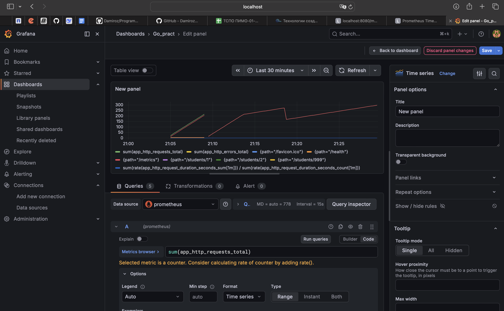
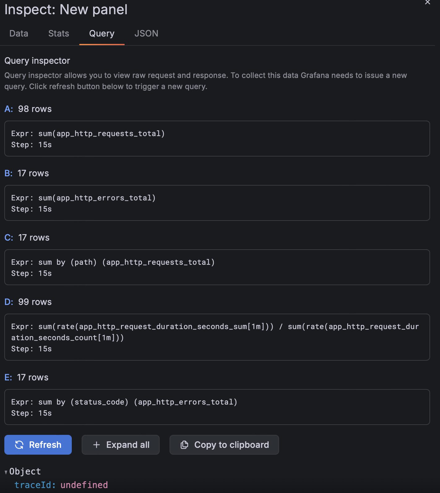

Генерируем нагрузку. 

```bash
for i in {1..20}; do curl http://localhost:8080/health; done
for i in {1..15}; do curl http://localhost:8080/students/1; done
for i in {1..5}; do curl http://localhost:8080/students/999; done
```
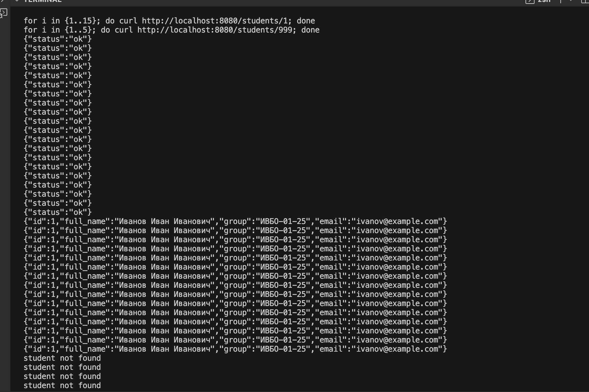
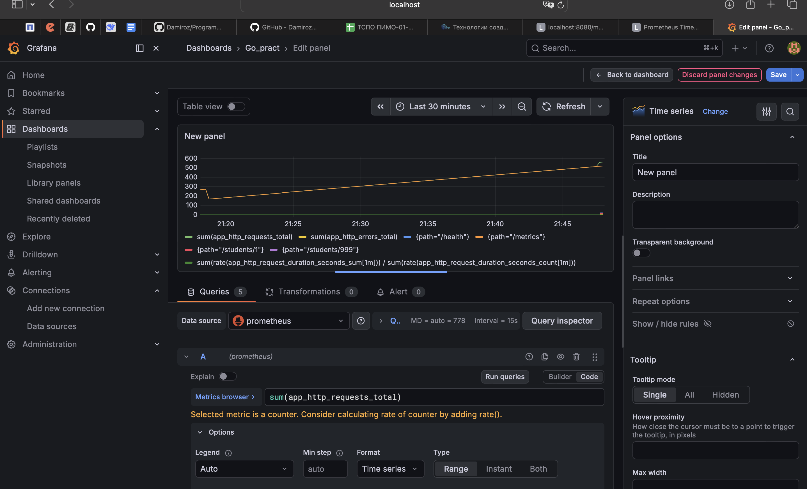

### 4. Контрольные вопросы 
1. Что такое метрики приложения?
Метрики — это числовые показатели, которые описывают состояние и поведение приложения во времени (например: число запросов, ошибок, время ответа).

2. Чем метрики отличаются от логов?
Логи показывают отдельные события (что произошло)
Метрики показывают общее состояние системы (как система работает в целом)

3. Какую роль выполняет Prometheus?
Prometheus:
- собирает метрики с приложений (scraping)
- хранит их как временные ряды
- позволяет делать запросы через PromQL
- используется для мониторинга состояния системы

4. Что такое scraping в Prometheus?
Scraping — это процесс, при котором Prometheus регулярно делает HTTP-запросы к /metrics и забирает метрики из приложения.

5. Зачем приложению маршрут /metrics?
Маршрут /metrics нужен для того, чтобы Prometheus мог получить данные о состоянии приложения в специальном формате.

6. Что делает promhttp.Handler()?
- создаёт HTTP handler
- экспортирует все зарегистрированные метрики Prometheus
- отдаёт их в формате, который понимает Prometheus

7. Для чего нужна Grafana?
Grafana используется для:
- визуализации метрик
- построения графиков и дашбордов
- анализа состояния системы в реальном времени

8. Какие три основные метрики реализованы в работе?
- app_http_requests_total — общее число запросов
- app_http_errors_total — количество ошибок
- app_http_request_duration_seconds — время обработки запросов

9. Что показывает Histogram?
Histogram показывает распределение значений (например, времени ответа сервера) по диапазонам (buckets).

10. Почему мониторинг важен для backend-приложений?
Мониторинг позволяет:
- вовремя обнаруживать ошибки
- отслеживать нагрузку
- видеть деградацию производительности
- обеспечивать стабильность системы